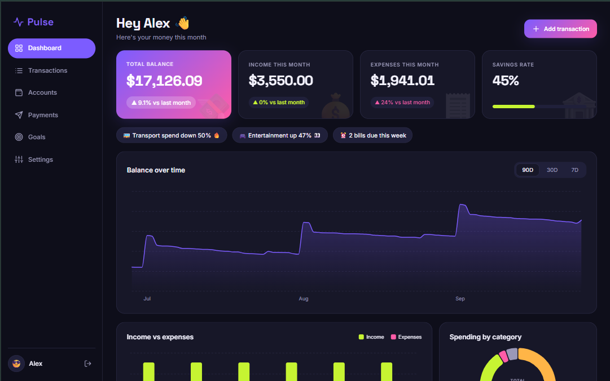
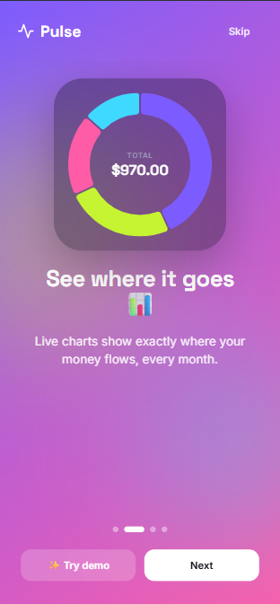
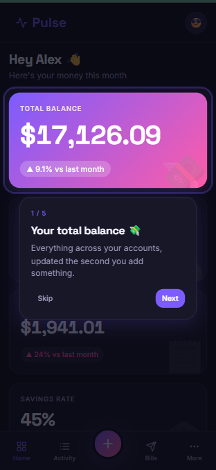
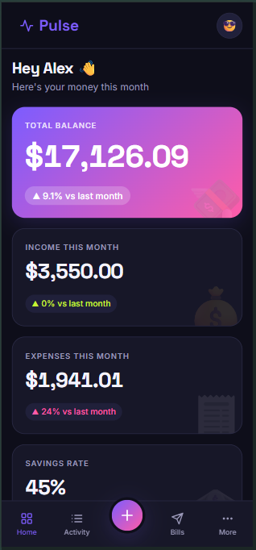
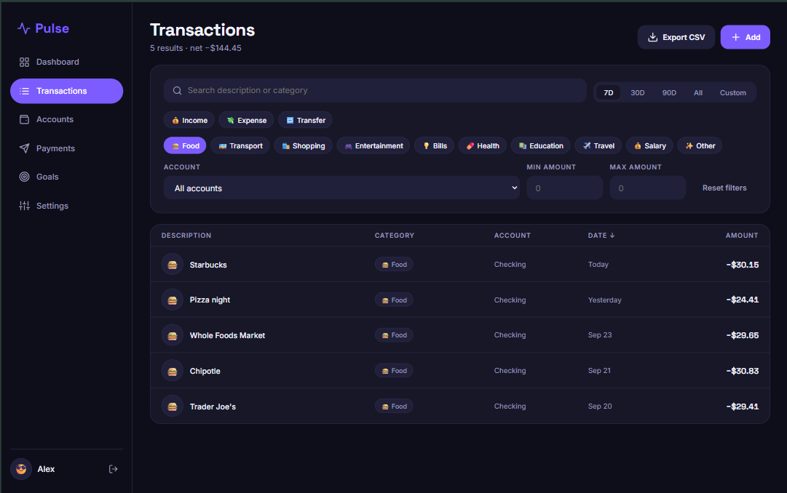

# Pulse 💸 money, finally readable

A playful personal-finance simulator for Gen Z. Track payments, expenses and account balances, then see where your money goes with interactive D3 charts.

**Live demo:** <VERCEL_URL> → click **✨ Try demo** for six months of sample data.



<p align="center">  </p>



## Features
- **Onboarding:** a swipeable welcome carousel, a 3-step setup wizard and a spotlight guided tour.
- **Auth (simulated):** register and log in with salted SHA-256 hashes in localStorage, plus a one-click demo.
- **Dashboard:** KPI tiles, "you spent 12% less on food 🔥" insights, and a balance line chart, income vs expenses bars and a category donut, all built with D3.
- **Transactions:** a sortable, paginated table with search, date presets, type, category, account and amount filters. Filters live in the URL, so views are shareable, and the filtered rows export to CSV.
- **Accounts:** per-account balances with sparklines, plus transfers between accounts.
- **Payments:** recurring bills with paid, upcoming and overdue status and one-tap "mark as paid".
- **Goals:** savings goals with animated progress rings.
- **Settings:** avatar, currency, dark and light themes, replay intro, reset or clear data.
- Responsive from 360px to widescreen, with reduced-motion support and keyboard-friendly dialogs.

## Stack & why
| | |
|---|---|
| React 19 + TypeScript + Vite | fast dev loop, typed domain model |
| D3 v7 | every chart is hand-built: React owns the `<svg>`, D3 draws scales, shapes and transitions in `useEffect` |
| Plain CSS (tokens + CSS Modules) | no CSS framework, so the design system is fully custom |
| react-router | routes, guards and URL-synced filters |
| Vitest | unit tests for all business logic |

Only four runtime dependencies: `react`, `react-dom`, `react-router-dom`, `d3`.

## Architecture
- `src/lib`, `src/data` and `src/state/financeReducer.ts` hold **pure, unit-tested logic**: balances, series, insights, filters, CSV, validation, seed data and the reducer.
- `src/state` holds React contexts: auth, and a per-user `useReducer` store saved to localStorage.
- `src/charts` holds D3 components. Each redraws on data or size change via a `ResizeObserver` hook.

## Run it
```bash
npm install
npm run dev      # http://localhost:5173
npm test         # unit tests
npm run build    # type-check + production build
```
Open via `localhost` (or HTTPS) — the Web Crypto API used for hashing needs a secure context.

## Heads-up
Pulse is a **simulation**. There is no backend and data never leaves your browser. Password hashing is for realism, not security, so don't reuse a real password.
